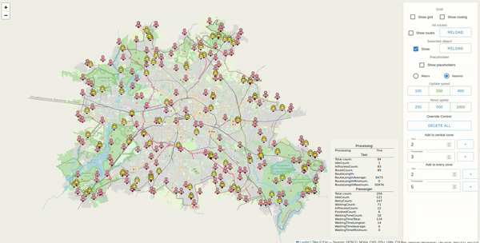

# Uber clone app [In progress]


Tech stack:
- Java
- React, React-leaflet, Routing Machine
- OpenStreetmap, osrm/osrm-backend
- Kafka
- ElasticSearch
- Redis
- Mongo

## Some startup stuff
```
npm install react-leaflet leaflet --save


npm install react-mapbox-gl mapbox-gl --save --legacy-peer-deps

docker run -t -v "${PWD}/berlin:/data" osrm/osrm-backend osrm-extract -p /opt/car.lua /data/berlin-latest.osm.pbf
docker run -t -v "${PWD}/berlin:/data" osrm/osrm-backend osrm-partition /data/berlin-latest.osrm
docker run -t -v "${PWD}/berlin:/data" osrm/osrm-backend osrm-customize /data/berlin-latest.osrm
docker run -t -i -p 5000:5000 -v "${PWD}/berlin:/data" osrm/osrm-backend osrm-routed --algorithm mld /data/berlin-latest.osrm
docker run -p 9966:9966 osrm/osrm-frontend   xdg-open 'http://127.0.0.1:9966'

http://localhost:5000/tile/v1/car/tile(14.33,52.5212,13.3919).mvt
http://localhost:5000/tile/v1/car/tile(1310,3166,13).mvt
http://localhost:5000/tile/v1/car/tile(8806,5375,14).mvt

http://router.project-osrm.org/tile/v1/car/tile(1310,3166,13).mvt
Mercator projection
https://map.project-osrm.org/?z=13&center=52.494958%2C13.556185&loc=52.517037%2C13.388860&hl=en&alt=0&srv=1
https://map.project-osrm.org/debug/bike.html#14/52.5051/13.4995
http://localhost:5000/tile/v1/car/tile(8806,5375,14).mvt


https://www.npmjs.com/package/react-mapbox-gl?activeTab=versions
https://github.com/alex3165/react-mapbox-gl/blob/HEAD/docs/API.md
```